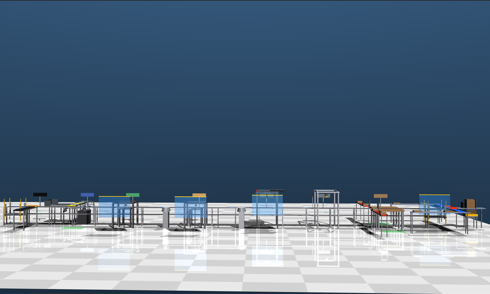
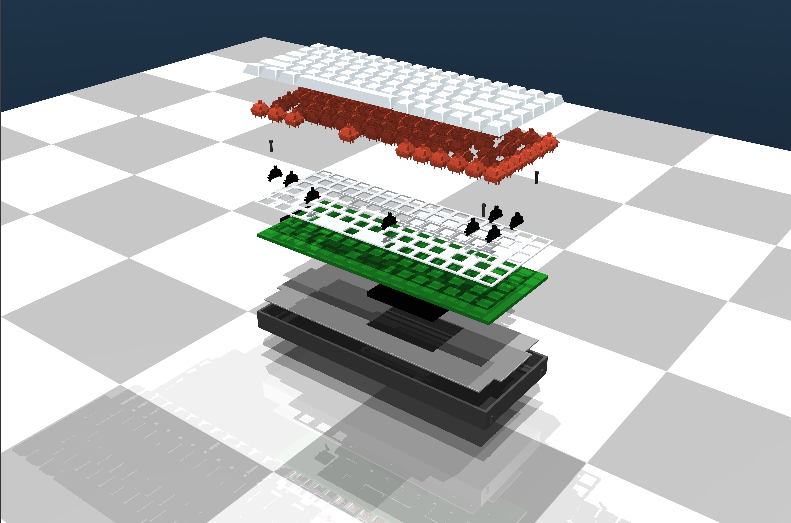
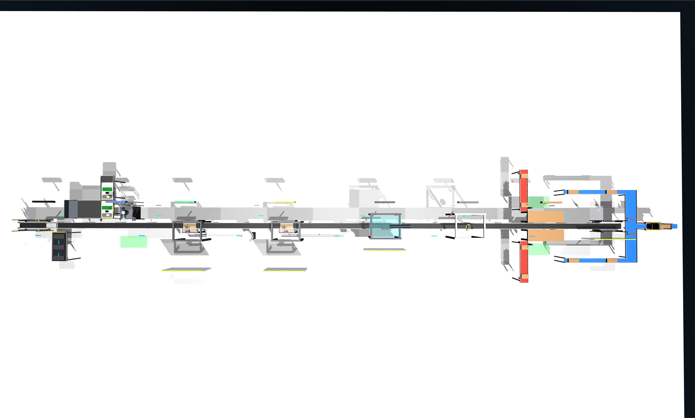
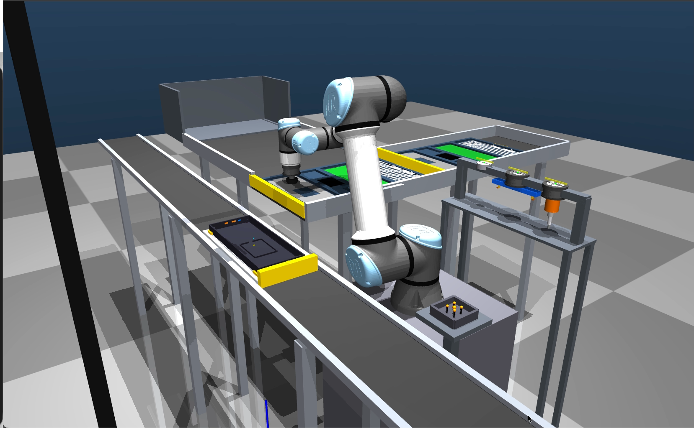
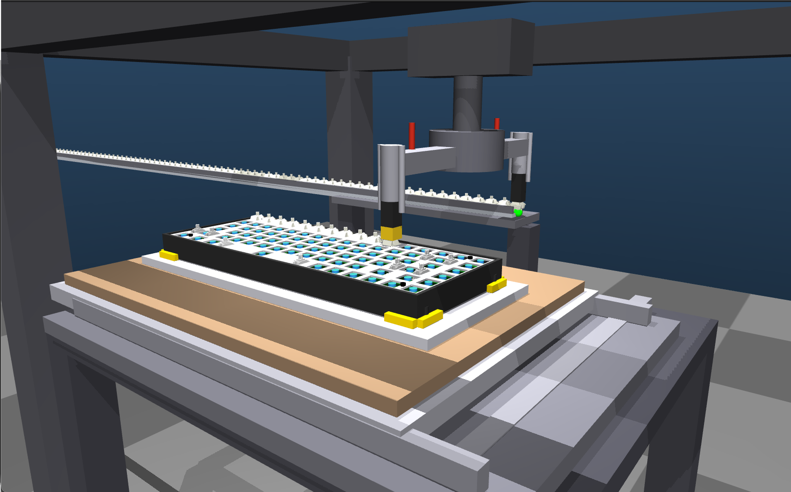
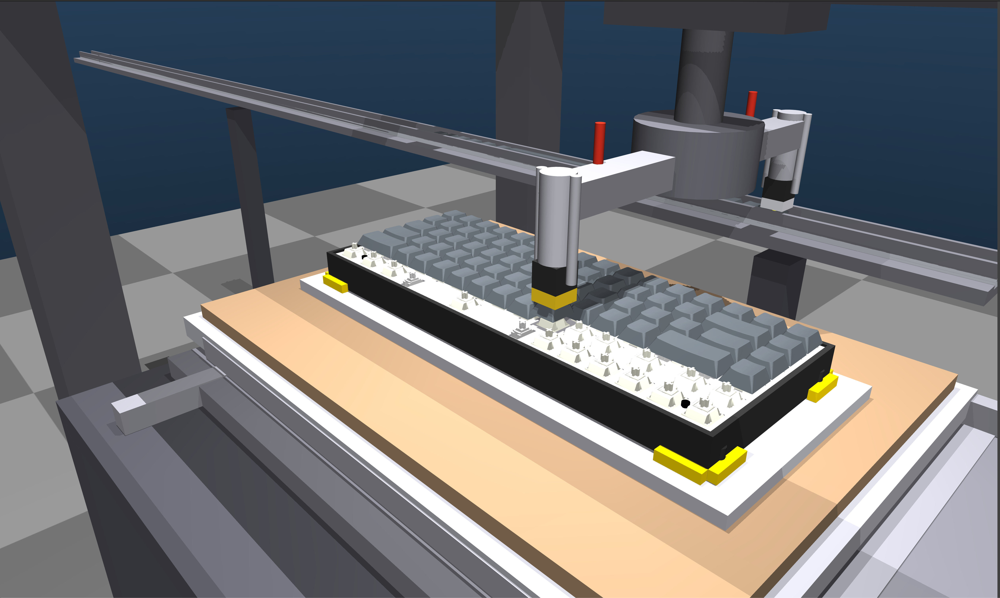

# Keychron K2 V3 — Robotic Assembly Cell Simulation



> 📹 Demo videos: [S1 Structural Assembly](https://youtu.be/91N1WJFZktE) · [S2 Switch Insertion](https://youtu.be/BPTmAEZaAYw) · [S3 Keycap Installation](https://youtu.be/ty300jLMMVc)  


A full multi-station robotic assembly cell for the **Keychron K2 V3 75% mechanical keyboard** (84 keys), designed and simulated in MuJoCo 3.5.0 as a solo project for AME 547 — Foundations for Manufacturing Automation at USC. The cell assembles a complete keyboard from kitted components across 4 active automated stations on an 18.5-meter CDLR conveyor, simulating 89.1s of UR5e structural assembly, 99.1s of switch insertion across all 84 sockets, and 94.1s of keycap installation across 7 key sizes — all with physics-stable part carry throughout.

---

## Cell Layout

```
[S0] ──► [S1] ──► [S2 BUFFER] ──► [S2] ──► [S3 BUFFER] ──► [S3] ──► [S4] ──► [S5] ──► [S6]

Main line: Chain Driven Live Roller (CDLR), left → right, 18.5m total
Pallet:    Aluminium tooling plate with 4-point bottom case fixture
Flow:      S0 → S1 → S2 → S3 → S4 → S5 → S6 → return conveyor → S0
```

| Station | Role | Mechanism | Cycle Time | Status |
|---------|------|-----------|------------|--------|
| **S0** | Bottom case loading | Manual / conveyor entry | ~10s | ✅ Modeled |
| **S1** | Structural assembly + screwing | UR5e with 3-tool changer + kit tray feeder | 89.1s | ✅ Simulated |
| **S2** | Switch insertion (84 switches) | Rotating dual-head gantry, XY slider table | 99.1s ← bottleneck | ✅ Simulated |
| **S3** | Keycap installation (84 keycaps, 7 sizes) | Rotating dual-head gantry, XY slider table | 94.1s | ✅ Simulated |
| **S4** | Laser legend printing | Gantry laser engraver | ~45s est. | 🔲 Conceptual |
| **S5** | Functional inspection | FTF + USB HID keycode verification | ~60s est. | 🔲 Conceptual |
| **S6** | Manual packaging | Human operator | ~90s est. | 🔲 Modeled |

**Throughput:** 36.3 units/hr theoretical · 30.4 units/hr effective (83.8% OEE)  
**Balance efficiency:** 91.6% across the three automated core stations (S1–S3)

## Simulation Screenshots


*Assembly stack — bottom case (dark), sound foam, battery, PCB, aluminium plate with stabilizers, switches, keycaps*


*Full 18.5m cell top-down plan view — S0 (left) through S6 (right)*


*S1 — UR5e collaborative robot with kit tray feeder, tool dock, and pallet on main CDLR*


*S2 — Dual-head rotating gantry mid-sequence, ~40 switches inserted*


*S3 — All 84 keycaps installed across 7 key sizes*

---

## Key Technical Highlights

### 1 — 6-DOF IK with Jacobian Pseudoinverse (S1)
Full 6-DOF inverse kinematics using `jacp` + `jacr` with a fixed target quaternion of `[0.7071, −0.7071, 0, 0]` (gripper straight-down). Position-only IK (`jacp` alone) causes Z-axis tilt on every pick and place; adding `jacr` with `ORI_W = 0.3` eliminates it. Elbow seed fixed at ~1.80 rad to avoid wrist singularities. Sub-0.05 mm position convergence, with per-boss IK seeds for the 4 screw boss locations.

### 2 — PCB Tilt-and-Insert Sequence (S1)
The PCB is picked flat, carried to a 50mm hover, tilted 10° via coordinated wrist rotation (slerp over 60 steps), held for a 5-second JST dwell while a human operator connects the battery harness, then simultaneously descended and rotated back to flat in a single 200-step interpolated motion. This replicates the actual manual assembly motion required by the 2mm JST connector geometry — a simple vertical descent is insufficient.

### 3 — Three-Tool Changer (S1)
Vacuum cup → pin gripper → screwdriver, docked on a fixed rack within UR5e reach. Tool state managed via fixed child body alpha toggling (freejoints fall under gravity if unsupported). Weld constraints activated post-screw-installation using `d.eq_active[eid]` (MuJoCo 3.x API), with `mj_forward` called between body teleport and weld activation. Absorbing screwing into S1 eliminates a separate station, a pallet transfer, and a full re-registration cycle.

### 4 — Physics-Stable Carry Pattern: Four-Bypass `sim_step` (S1, S2, S3)
The canonical stability pattern across all three active stations. Every simulation step: (1) teleport table/arm to target via direct `d.qpos` writes, (2) re-snap placed parts to the plate so they move with it, (3) gravity-lock unpicked tray parts in place, (4) re-snap in-transit parts to the gripper tip using a `carry_offset` computed at pick moment. Keeps 84+ freejoint bodies stable in a ~600-DOF model where position actuators fail to converge due to effective mass. `carry_offset` is computed once at pick time and re-applied every step — never recomputed after physics has moved parts.

### 5 — Dual-Head Rotating Gantry with XY Slider Table (S2, S3)
Rather than moving an insertion head to each of the 84 socket locations, the keyboard moves under a fixed head via a 2-axis motorized XY slider table. Positioning error is then driven purely by slider repeatability — not accumulated robot absolute error across a 315mm board. The rotating column carries two opposed arms: one inserts while the other simultaneously picks, effectively halving per-switch dead time. Column rotation, XY repositioning, and belt advance all execute concurrently each cycle.

### 6 — Variable-Pitch Keycap Tray Advance (S3)
Seven keycap sizes (1U through 6.25U) mean the belt advance distance between consecutive picks is not constant. The controller computes the required advance for each consecutive pair from a pre-defined width map (`current_width/2 + 2mm gap + next_width/2`) before each rotation phase, executing it concurrently with rotation and XY travel — no additional dead time from the size variety.

### 7 — Stabilizer Mesh Pipeline
8 housings × 2 plates = 16 mesh-based fixed child bodies, pre-installed on the aluminium plate before the plate enters the cell (offline fixture, Boothroyd pre-assembly principle). Pipeline: GrabCAD → FreeCAD (STEP) → Blender (decimate to ~3,900 triangles, origin-to-geometry, Z-floor align, scale=0.001 export) → MuJoCo STL. `refquat="0.7071 -0.7071 0 0"` corrects mesh orientation from STL coordinate frame to MuJoCo body frame.

---

## How to Run

### Requirements
- macOS Apple Silicon (M1/M2/M3) — `mjpython` required for MuJoCo viewer on macOS
- Python 3.11
- MuJoCo 3.5.0

```bash
git clone https://github.com/Vijeyavelan/AME547_Keyboard_Assembly.git
cd AME547_Keyboard_Assembly
pip install mujoco==3.5.0 numpy
```

```bash
# Station 1 — UR5e structural assembly, tool changes, screwing (89.1s cycle)
mjpython controllers/station1_controller1.py

# Station 2 — Switch insertion, 84 switches (99.1s cycle)
mjpython controllers/station3_controller.py

# Station 3 — Keycap installation, 84 keycaps × 7 sizes (94.1s cycle)
mjpython controllers/station4_controller.py

# Full assembly cell — complete S0→S6 pallet flow
mjpython controllers/assembly_cell_controller.py
```

> **Note:** Use `mjpython`, not `python`. On macOS, MuJoCo requires its own launcher to satisfy the platform's main-thread OpenGL rendering constraint. Ordinary `python` will fail silently or crash at viewer launch.

### MuJoCo Viewer Controls
| Key | Action |
|-----|--------|
| `Space` | Pause / resume |
| Scroll | Zoom |
| Right-drag | Rotate camera |
| `Ctrl+R` | Reset simulation |
| `F` | Toggle free camera |

---

## Repo Structure

```
AME547_Keyboard_Assembly/
├── controllers/
│   ├── station1.py                  # S1: UR5e pick-place, tool change, screwing
│   ├── station2.py                  # S2: switch insertion gantry
│   ├── station3.py                  # S3: keycap installation gantry
│   └── assembly_cell.py             # Full cell sequencing, S0–S6
├── models/
│   ├── stations/
│   │   ├── station1.xml             # S1 model (UR5e, CDLR segment, kit tray, tool dock)
│   │   ├── station2.xml             # S2 gantry + XY table model
│   │   └── station3.xml             # S3 gantry + XY table model
│   └── assembly_cell.xml            # Full 18.5m cell, all stations on CDLR backbone
├── assets/
│   └── images/                      # Simulation screenshots for README
├── requirements.txt
├── LICENSE
└── README.md
```

---

## Design Rationale

**Why XY slider table instead of a robot arm at S2/S3?**
A robot arm reaching across a 315mm board at ±0.3mm socket tolerance accumulates absolute positioning error that causes systematic failures beyond the third key in any row. The slider table inverts the problem — only repeatability matters. The keyboard moves, the head stays fixed.

**Why UR5e at S1?**
The JST connector mating step requires a human operator inside the robot workspace during the PCB dwell phase. The UR5e is ISO/TS 15066 collaborative, eliminating the safety fence that would prevent operator access. No other robot class at this payload and reach is appropriate for this station.

**Why absorb screwing into S1?**
A separate screwing station adds a pallet transfer and re-registration cycle on top of the tool change time that already exists at S1. Eliminating it keeps the three automated stations within a 10-second cycle time window (91.6% core balance efficiency).

**Why direct `d.qpos` writes instead of position actuators?**
In a ~600-DOF model with 84+ freejoint bodies, position actuator gains are overwhelmed by effective inertia. Direct state writes are deterministic and computationally cheaper.

**Why pre-install stabilizers?**
Stabilizer installation requires precise pin alignment and wire routing across 8 locations — not economically automatable at keyboard production volumes. Pre-installation on an offline fixture reflects Boothroyd's principle: operations completable offline at lower cost and risk should not enter the main line cycle.

---

## Cycle Time Detail

**S1 operation-level breakdown (89.1s total):**

| Operation | Time |
|-----------|------|
| Place EPDM foam | 6.3s |
| Place battery | 6.4s |
| PCB tilt-and-insert (incl. 5s JST dwell) | 11.9s |
| Tool change: vacuum → pin gripper | 6.8s |
| Place aluminium plate | 8.0s |
| Tray ejection | 5.0s |
| Tool change: pin gripper → screwdriver | 6.7s |
| Drive 4 × M2 screws (FL, FR, RL, RR) | 29.0s |
| Tool reset + post-assembly inspection | 8.6s |
| **S1 Total** | **89.1s** |

**S2/S3 per-key breakdown:**

| Station | Rotate + XY + Belt advance | Insert/press + pick | Per key | × 84 keys |
|---------|---------------------------|---------------------|---------|-----------|
| S2 — Switch insertion | 0.460s | 0.720s | 1.180s | **99.1s** |
| S3 — Keycap installation | 0.460s | 0.660s | 1.120s | **94.1s** |

---

## Stack

| Tool | Detail |
|------|--------|
| Simulation | MuJoCo 3.5.0 |
| Language | Python 3.11 |
| Robot model | UR5e from MuJoCo Menagerie |
| Mesh pipeline | GrabCAD → FreeCAD → Blender → MuJoCo STL |
| Keyboard layout | ai03 plate generator (KLE JSON) |
| Platform | macOS Apple Silicon (`mjpython`) |

---

## Course Context

AME 547 — Foundations for Manufacturing Automation, USC Viterbi School of Engineering, Spring 2026. Individual project. Full report covering product decomposition, operation precedence constraints, station design, cell architecture, cycle time analysis, line balancing (OEE, balance efficiency), and simulation methodology is available in the repository.

---

## License

MIT — see [LICENSE](LICENSE).